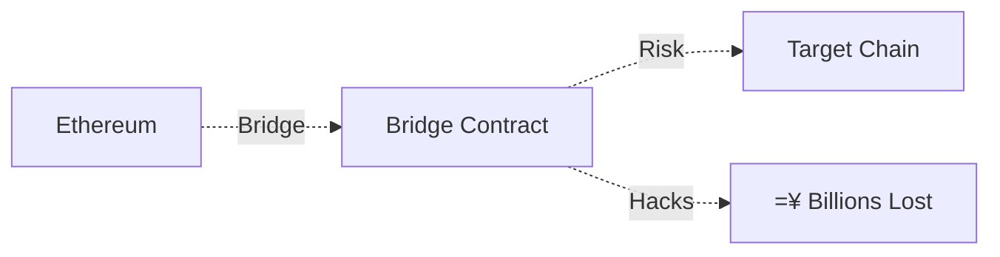
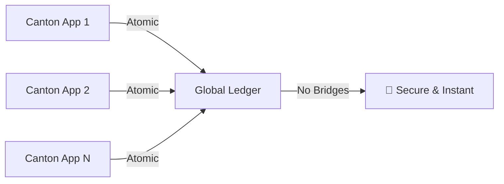

# Canton
## The Privacy-Preserving Enterprise Blockchain

*Digital Asset's revolutionary approach to enterprise blockchain technology*

<div class="pt-12">
  <span @click="$slidev.nav.next" class="px-2 py-1 rounded cursor-pointer" hover="bg-white bg-opacity-10">
    Press Space to start presentation <carbon:arrow-right class="inline"/>
  </span>
</div>

---
transition: fade-out
---

# What is Canton?

Canton is a **privacy-preserving, interoperable blockchain platform** designed specifically for enterprise use cases.

<v-clicks>

- = **Sub-transaction privacy** - Parties only see relevant data
- < **True interoperability** - No bridges needed between Canton apps
- =Ü **DAML smart contracts** - Business-logic focused language
- <Û **Enterprise-ready** - Built for regulated financial institutions
- ¡ **Unlimited scalability** - Two-tier consensus architecture
-  **GDPR compliant** - Built-in data minimization and "right to be forgotten"

</v-clicks>

<arrow v-click="3" x1="400" y1="420" x2="230" y2="330" color="#564" width="3" arrowSize="1" />

---
layout: default
---

# Canton's Unique Value Proposition

What makes Canton different from other blockchain platforms?

````md magic-move
```ts {all|2|3|4|5|6|7|all}
interface BlockchainComparison {
  privacy: "Sub-transaction privacy",
  consensus: "Two-tier consensus for unlimited scalability", 
  interoperability: "Native atomic cross-chain transactions",
  compliance: "Built-in GDPR compliance and data minimization",
  smartContracts: "DAML - business logic focused language",
  architecture: "Privacy-enabled public blockchain",
  targetMarket: "Regulated financial institutions"
}
```
```ts {all|1,7|2,6|3,5|4|all}
interface TraditionalBlockchains {
  ethereum: { privacy: "None", scalability: "Limited", enterprise: "Poor" },
  hyperledger: { privacy: "Private only", interop: "Limited", public: "No" },
  corda: { blockchain: "Not truly", global: "No", interop: "Point-to-point" },
  // Canton combines the best of all worlds
  canton: { privacy: "", scalability: "", enterprise: "", public: "" }
}
```
````

---
layout: center
class: text-center
---

# Market Position & Competition

<div class="grid grid-cols-2 gap-8 mt-8">

<div>

## Traditional Approaches

<v-clicks>

**Ethereum**: Public but no privacy
- All transactions visible
- Limited enterprise adoption
- Gas fees & scalability issues

**Hyperledger**: Private but siloed  
- No public network benefits
- Limited interoperability
- Complex consortium management

</v-clicks>

</div>

<div>

## Canton's Innovation

<v-clicks>

**Privacy + Public Benefits**
- Sub-transaction privacy on public network
- Global network effects with enterprise controls
- Regulatory compliance built-in

**True Interoperability**
- No bridges between Canton applications
- Atomic cross-chain transactions
- Single virtual global ledger

</v-clicks>

</div>

</div>

---
layout: fact
---

# $135 Million
Funding raised in **June 2025** from Citadel Securities, DRW, DTCC, and other major financial institutions

---
layout: default
---

# Major Adoption & Real-World Implementations

<div class="grid grid-cols-2 gap-6">

<div>

## Key Partnerships & Clients

<v-clicks>

- **Goldman Sachs** - GS DAP" securities tokenization
- **Deutsche Börse** - D7 post-trade platform 
- **ASX** - Australian Securities Exchange
- **BNP Paribas** - Banking applications
- **Microsoft** - Technology partnership
- **Chainlink** - Data feeds & cross-chain messaging

</v-clicks>

</div>

<div>

## Recent Milestones

<v-clicks>

- **MainNet Launch**: July 2024
- **October 2024 Pilot**: 27 participants including Euroclear, World Gold Council
- **22 Independent dApps** with 350+ simulated transactions
- **Canton Coin** native token launched
- **Live Deployments** expected 2025-2026

</v-clicks>

</div>

</div>

---
layout: center
---

# Technical Architecture Highlights

<div class="grid grid-cols-3 gap-8 mt-8">

<div class="text-center">
<div class="text-4xl mb-4">=</div>

**Sub-transaction Privacy**

Parties only see transaction parts relevant to them, unlike public blockchains where all data is visible

</div>

<div class="text-center">
<div class="text-4xl mb-4">¡</div>

**Two-tier Consensus**

Enables unlimited horizontal scalability while maintaining full smart contract interoperability

</div>

<div class="text-center">
<div class="text-4xl mb-4"><</div>

**Global Synchronization**

All Canton applications connect into a single virtual global ledger

</div>

</div>

---
layout: default
---

# DAML Smart Contract Language

Why DAML is revolutionary for enterprise blockchain development

<div class="grid grid-cols-2 gap-8">

<div>

## Traditional Smart Contracts
```solidity
// Ethereum Solidity - low level
contract Token {
    mapping(address => uint) balances;
    
    function transfer(address to, uint amount) {
        require(balances[msg.sender] >= amount);
        balances[msg.sender] -= amount;
        balances[to] += amount;
    }
}
```

</div>

<div>

## DAML Contracts
```daml
-- Business logic focused
template Asset
  with
    owner: Party
    amount: Decimal
  where
    signatory owner
    
    choice Transfer: ContractId Asset
      with newOwner: Party
      controller owner
      do create this with owner = newOwner
```

</div>

</div>

<v-clicks>

- **Need-to-know Privacy**: Information shared only with authorized parties
- **Multi-platform**: Runs on Fabric, Corda, Besu, VMware Blockchain, PostgreSQL  
- **Business Logic Focus**: Express contracts, rights, and obligations directly

</v-clicks>

---
layout: default
---

# Blockchain Interoperability Revolution

Canton's unique approach to cross-chain functionality

<div class="mt-8">

## Traditional Cross-Chain (Bridges)


## Canton Native Interoperability  


</div>

<v-clicks>

- **No Bridges Required** between Canton applications
- **Atomic Transactions** across multiple applications
- **Bitcoin Integration** (CBTC) already implemented with 1:1 backing

</v-clicks>

---
layout: center
---

# Canton vs Competition

<div class="overflow-x-auto">

| Feature | Canton | Ethereum | Hyperledger | R3 Corda |
|---------|--------|----------|-------------|----------|
| **Privacy** |  Sub-transaction | L All public |  Private only |  Point-to-point |
| **Public Network** |  Yes |  Yes | L No | L No |  
| **Interoperability** |  Native atomic |   Bridges only |   Limited |   Point-to-point |
| **Enterprise Ready** |  Built for it | L Poor fit |  Yes |  Yes |
| **Scalability** |  Unlimited | L Limited |  Good |  Good |
| **GDPR Compliance** |  Built-in | L No |   Depends |   Depends |
| **Real Blockchain** |  Yes |  Yes |  Yes | L Distributed ledger |

</div>

---
layout: center
class: text-center
---

# Industry Impact

<div class="grid grid-cols-2 gap-12 mt-8">

<div>

## Financial Services Revolution

<v-clicks>

- **Securities Tokenization**: Goldman Sachs GS DAP"
- **Post-Trade Processing**: Deutsche Börse D7  
- **Digital Asset Trading**: Multiple exchanges
- **Trade Finance**: BNP Paribas implementations

</v-clicks>

</div>

<div>

## Regulatory Compliance

<v-clicks>

- **GDPR by Design**: Right to be forgotten built-in
- **Data Minimization**: Only relevant parties see data
- **Audit Trails**: Complete transaction history with privacy
- **KYC/AML Integration**: Built for regulated institutions

</v-clicks>

</div>

</div>

---
layout: default
---

# Recent Developments & Future Roadmap

<Timeline>

<TimelineItem date="2024 Q3">
<template #title>MainNet Launch</template>
Canton MainNet goes live with Canton Coin
</TimelineItem>

<TimelineItem date="2024 Q4">
<template #title>Multi-Party Pilots</template>
27 participants including Euroclear, World Gold Council complete successful pilots
</TimelineItem>

<TimelineItem date="2025 Q2">
<template #title>Major Funding</template>
$135M raised from Citadel Securities, DRW, DTCC
</TimelineItem>

<TimelineItem date="2025-2026">
<template #title>Production Deployments</template>
Major financial institutions expected to go live with Canton applications
</TimelineItem>

</Timeline>

---
layout: center
class: text-center
---

# Key Takeaways

<v-clicks>

1. **Privacy Innovation** - Only blockchain offering sub-transaction privacy on a public network

2. **Enterprise Ready** - Built specifically for regulated financial institutions  

3. **True Interoperability** - No bridges needed, native atomic transactions

4. **Proven Adoption** - Major financial players actively building and deploying

5. **Regulatory Compliance** - GDPR compliance and data minimization built-in

6. **Market Timing** - Perfect moment as institutions seek blockchain adoption

</v-clicks>

---
layout: end
class: text-center
---

# Canton
## The Future of Enterprise Blockchain

**Privacy-Preserving " Interoperable " Enterprise-Ready**

<div class="pt-12">
  Learn more at **canton.io** and **digitalasset.com**
</div>

---
layout: center
---

# Questions & Discussion

<div class="text-center mt-12">
  <div class="text-6xl mb-8">></div>
  <div class="text-xl opacity-75">
    Ready to explore how Canton can transform your blockchain applications?
  </div>
</div>