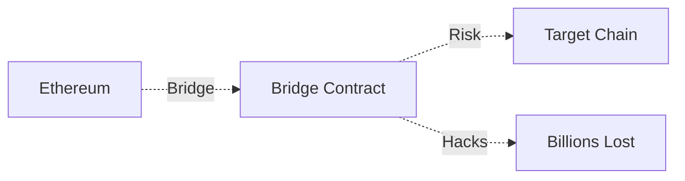
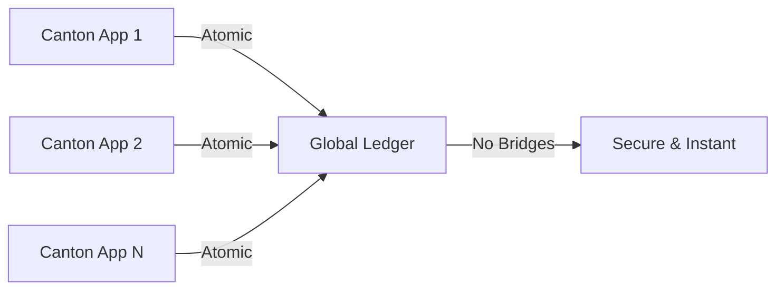

# Canton
## The Privacy-Preserving Enterprise Blockchain

*Digital Asset's revolutionary approach to enterprise blockchain technology*

<div class="pt-12">
  <span @click="$slidev.nav.next" class="px-2 py-1 rounded cursor-pointer" hover="bg-white bg-opacity-10">
    (Press Space to start) <carbon:arrow-right class="inline"/>
  </span>
</div>

---
transition: fade-out
layout: center
---

# What this presentation covers:

<v-clicks>

- **What is canton**
- **What is the USP**

</v-clicks>


---
transition: fade-out
---

# What is Canton?

Canton is a **privacy-preserving, interoperable blockchain platform** designed specifically for enterprise use cases.

<v-clicks>

- **Sub-transaction privacy** - Parties only see relevant data
- **True interoperability** - No bridges needed between Canton apps
- **DAML smart contracts** - Business-logic focused language
- **Enterprise-ready** - Built for regulated financial institutions
- **Unlimited scalability** - Two-tier consensus architecture
- **GDPR compliant** - Built-in data minimization and "right to be forgotten"

</v-clicks>


---
layout: default
---

# Canton's Unique Value Proposition

What makes Canton different from other blockchain platforms?

````md magic-move
```ts {all|2|3|4|5|6|7|all}
interface BlockchainComparison {
  privacy: "Sub-transaction privacy",
  consensus: "Two-tier consensus for unlimited scalability", 
  interoperability: "Native atomic cross-chain transactions",
  compliance: "Built-in GDPR compliance and data minimization",
  smartContracts: "DAML - business logic focused language",
  architecture: "Privacy-enabled public blockchain",
  targetMarket: "Regulated financial institutions"
}
```
```ts {all|1,7|2,6|3,5|4|all}
interface TraditionalBlockchains {
  ethereum: { privacy: "None", scalability: "Limited", enterprise: "Poor" },
  hyperledger: { privacy: "Private only", interop: "Limited", public: "No" },
  corda: { blockchain: "Not truly", global: "No", interop: "Point-to-point" },
  // Canton combines the best of all worlds
  canton: { privacy: "✅", scalability: "✅", enterprise: "✅", public: "✅" }
}
```
````

---
layout: center
class: text-center
---

# Market Position & Competition

<div class="grid grid-cols-2 gap-8 mt-8">

<div>

## Traditional Approaches

<v-clicks>

**Ethereum**: Public but no privacy
- All transactions visible
- Limited enterprise adoption
- Gas fees & scalability issues

**Hyperledger**: Private but siloed  
- No public network benefits
- Limited interoperability
- Complex consortium management

</v-clicks>

</div>

<div>

## Canton's Innovation

<v-clicks>

**Privacy + Public Benefits**
- Sub-transaction privacy on public network
- Global network effects with enterprise controls
- Regulatory compliance built-in

**True Interoperability**
- No bridges between Canton applications
- Atomic cross-chain transactions
- Single virtual global ledger

</v-clicks>

</div>

</div>

---
layout: default
---

# Major Adoption & Real-World Implementations

<div class="grid grid-cols-2 gap-6">

<div>

## Key Partnerships & Clients

<v-clicks>

- **Goldman Sachs** - GS DAP securities tokenization
- **Deutsche Börse** - D7 post-trade platform 
- **ASX** - Australian Securities Exchange
- **BNP Paribas** - Banking applications
- **Microsoft** - Technology partnership
- **Chainlink** - Data feeds & cross-chain messaging

</v-clicks>

</div>

<div>

## Recent Milestones

<v-clicks>

- **MainNet Launch**: July 2024
- **October 2024 Pilot**: 27 participants including Euroclear, World Gold Council
- **22 Independent dApps** with 350+ simulated transactions
- **Canton Coin** native token launched
- **Live Deployments** expected 2025-2026

</v-clicks>

</div>

</div>

---
layout: default
---

# Blockchain Interoperability Revolution

Canton's unique approach to cross-chain functionality

<div class="mt-8">

## Traditional Cross-Chain (Bridges)


## Canton Native Interoperability  


</div>

<v-clicks>

- **No Bridges Required** between Canton applications
- **Atomic Transactions** across multiple applications
- **Bitcoin Integration** (CBTC) already implemented with 1:1 backing

</v-clicks>

---
layout: center
class: text-center
---

# Key Takeaways

<v-clicks>

1. **Privacy Innovation** - Only blockchain offering sub-transaction privacy on a public network

2. **Enterprise Ready** - Built specifically for regulated financial institutions  

3. **True Interoperability** - No bridges needed, native atomic transactions

4. **Proven Adoption** - Major financial players actively building and deploying

5. **Regulatory Compliance** - GDPR compliance and data minimization built-in

6. **Market Timing** - Perfect moment as institutions seek blockchain adoption

</v-clicks>

---
layout: end
class: text-center
---

# Canton

**Privacy-Preserving - Interoperable - Enterprise-Ready**

<div class="pt-12">
  Learn more at <a href="canton.io">canton.io</a> and <a href="digitalasset.com">digitalasset.com</a>
</div>
