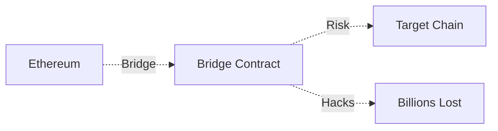
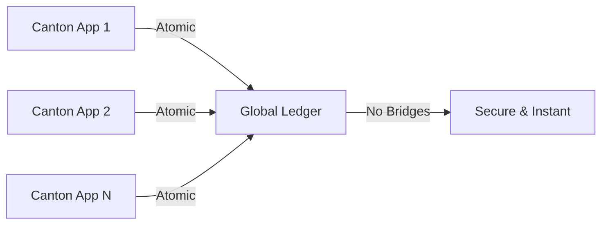

# Canton
## The Privacy-Preserving Enterprise Blockchain

*Digital Asset's approach to enterprise blockchain technology*

<div class="pt-12">
  <span @click="$slidev.nav.next" class="px-2 py-1 rounded cursor-pointer" hover="bg-white bg-opacity-10">
    (Press Space to start) <carbon:arrow-right class="inline"/>
  </span>
</div>

---
transition: fade-out
---

# What is Canton?

Canton is a **privacy-preserving, interoperable blockchain platform** designed specifically for enterprise use cases.

<v-clicks>

- **Sub-transaction privacy** - Parties only see relevant data
- **True interoperability** - No bridges needed between Canton apps
- **DAML smart contracts** - Business-logic focused language
- **Enterprise-ready** - Built for regulated financial institutions
- **Unlimited scalability** - Two-tier consensus architecture
- **GDPR compliant** - Built-in data minimization and "right to be forgotten"

</v-clicks>


---
layout: default
---

# Canton's Unique Value Proposition

What makes Canton different from other blockchain platforms?

````md magic-move
```ts {all|2|3|4|5|6|7|all}
interface BlockchainComparison {
  privacy: "Sub-transaction privacy",
  consensus: "Two-tier consensus for unlimited scalability", 
  interoperability: "Native atomic cross-chain transactions",
  compliance: "Built-in GDPR compliance and data minimization",
  smartContracts: "DAML - business logic focused language",
  architecture: "Privacy-enabled public blockchain",
  targetMarket: "Regulated financial institutions"
}
```
```ts {all|1,7|2,6|3,5|4|all}
interface TraditionalBlockchains {
  ethereum: { privacy: "None", scalability: "Limited", enterprise: "Poor" },
  hyperledger: { privacy: "Private only", interop: "Limited", public: "No" },
  corda: { blockchain: "Not truly", global: "No", interop: "Point-to-point" },
  // Canton combines the best of all worlds
  canton: { privacy: "✅", scalability: "✅", enterprise: "✅", public: "✅" }
}
```
````

---
layout: center
class: text-center
---

# Market Position & Competition

<div class="grid grid-cols-2 gap-8 mt-8">

<div>

## Traditional Approaches

<v-clicks>

**Ethereum**: Public but no privacy
- All transactions visible
- Limited enterprise adoption
- Gas fees & scalability issues

**Hyperledger**: Private but siloed  
- No public network benefits
- Limited interoperability
- Complex consortium management

</v-clicks>

</div>

<div>

## Canton's Innovation

<v-clicks>

**Privacy + Public Benefits**
- Sub-transaction privacy on public network
- Global network effects with enterprise controls
- Regulatory compliance built-in

**True Interoperability**
- No bridges between Canton applications
- Atomic cross-chain transactions
- Single virtual global ledger

</v-clicks>

</div>

</div>

---
layout: default
---

# Major Adoption & Real-World Implementations

<div class="grid grid-cols-2 gap-6">

<div>

## Key Partnerships & Clients

<v-clicks>

- **Goldman Sachs** - GS DAP securities tokenization
- **Deutsche Börse** - D7 post-trade platform 
- **ASX** - Australian Securities Exchange
- **BNP Paribas** - Banking applications
- **Microsoft** - Technology partnership
- **Chainlink** - Data feeds & cross-chain messaging

</v-clicks>

</div>

<div>

## Recent Milestones

<v-clicks>

- **MainNet Launch**: July 2024
- **October 2024 Pilot**: 27 participants including Euroclear, World Gold Council
- **22 Independent dApps** with 350+ simulated transactions
- **Canton Coin** native token launched
- **Live Deployments** expected 2025-2026

</v-clicks>

</div>

</div>

---
layout: default
---

# Blockchain Interoperability Revolution

Canton's unique approach to cross-chain functionality

<div class="mt-8">

## Traditional Cross-Chain (Bridges)


## Canton Native Interoperability  


</div>


<v-clicks>

- **No Bridges Required** between Canton applications
- **Atomic Transactions** across multiple applications
- **Bitcoin Integration** (CBTC) already implemented with 1:1 backing

</v-clicks>


---
layout: default
transition: fade-out
---

# Canton <-> Ethereum Interoperability

<div class="mt-8">

There is first-class support in canton <-> canton networks.

A separate process is required to react to events from the source and target chains 

(e.g. canton <-> Ethereum)

Therefore, to make it *atomically safe* requires a bridge design which:
1. locks value on the source side
2. only mints/relases after finality
3. has timeouts + compensations


</div>

---
layout: default
---
# Canton <-> Ethereum Interoperability

#### Option 1. Escrow + Finality + Timeouts (recommended for MVP)


<div class="flex flex-cols-2 p-2" >
<div>
<h4 class="text-primary">Flow ETH → Daml (lock/mint)</h4>
<span class="text-sm">Lock tokens in an ERC-20 escrow contract; only after N confirmations mint/release on Daml</span>
<v-clicks>
<ol class="text-sm">
<li>User calls escrow.deposit(amount, recipientDamlParty, nonce) → ERC-20 moves to escrow; emits DepositLocked(nonce, …)</li>
<li>Bridge waits N confs, then creates MintRequest (with nonce, amount, party) on Daml</li>
<li>Daml mints (or marks claimable) and stores nonce as a contract key to prevent duplicates</li>
<li>If Daml mint fails before a deadline, user can refund(nonce) on escrow after timeout</li>
</ol>
</v-clicks>
</div>

<div>
<h4 class="text-red">Flow Daml → ETH (burn/release or lock/release)</h4>
<span class="text-sm">lock on Daml first, then release on Ethereum, or burn on Daml only after ETH release is confirmed. Use timeouts so any “half” step can be safely undone.</span>
<v-clicks>
<ol class="text-sm">
<li>Daml <b>locks</b> (or burns) user’s Daml tokens by creating ReleaseRequest (with nonce, amount, to) (the lock/burn prevents double-spend)</li>
<li>Bridge executes escrow.release(nonce, to, amount) on ETH; waits N confs</li>
<li>Bridge <b>finalises</b> on Daml (archives the request, records ReleaseFinalized)</li>
<li>If ETH tx never finalises by deadline, Daml <b>compensates</b> (unlock/restore) via a Cancel choice</li>
</ol>
</v-clicks>
</div>
</div>

---
layout: default
---
# Canton <-> Ethereum Interoperability

#### Option 2. Two-Phase commit with a trusted operator (simplest operationally)
 * One bridge process acts as a transaction manager:

 * Daml locks tokens → bridge writes an outbox record, sends ETH tx, waits finality → writes commit event back to Daml.

 * If the ETH leg fails, the bridge issues a **compensating** Daml choice (unlock).

Guarantees come from idempotency keys, durable outbox/inbox, and sagas. This is not cryptographically atomic, but operationally safe and easy to reason about for a single operator domain.

---
layout: default
---
# Canton <-> Ethereum Interoperability

### Option 3. Hash-Time-Locked (HTLC) swap (more trust-minimised)
Both sides lock under the same hash h=H(s) and timeouts T_eth > T_daml.

 * Claimer reveals [some secret] on one side; bridge relays [some secret] to claim on the other.

 * If either side times out, funds are safely reclaimed.

This reduces trust in the bridge, but increases protocol complexity.


---
layout: default
transition: fade-out
---
# Canton <-> Ethereum Interoperability

### Appendix: Example Daml Bridge Contract

<div class="mt-8">

```ts {all}{maxHeight:'20pc'}
module Bridge where

import Daml.Script

-- Parties
record BridgeParties = { operator : Party, user : Party }

-- Off-ledger references
record EthConfig = { erc20Address : Text, chainId : Int }

-- Command templates emitted by the Daml app for the bridge service to act upon
template LockOnEth
  with
    parties : BridgeParties
    cfg : EthConfig
    to : Text -- hex EVM address
    amount : Decimal -- token amount in human units
  where
    signatory parties.user
    observer parties.operator

    choice Consumed : () with
      cid : ContractId LockOnEth
    controller parties.operator
    do archive cid

-- Event template for tx confirmations from Ethereum → Daml
template EthTxConfirmed
  with
    parties : BridgeParties
    txHash : Text
    to : Text
    amount : Decimal
  where
    signatory parties.operator, parties.user


-- Simple setup script
setup : Script (ContractId LockOnEth)
setup = script do
  operator <- allocatePartyWithHint "Operator" (PartyIdHint "operator")
  user <- allocatePartyWithHint "User" (PartyIdHint "user")
  let parties = BridgeParties operator user
  submit user do
    create LockOnEth with
      parties
      cfg = EthConfig "0xERC20_ADDRESS" 31337
      to = "0xReceiverAddr"
      amount = 100.0
```

</div>
---
layout: default
transition: fade-out
---
# Canton <-> Ethereum Interoperability
### Event Listener Job

<div class="mt-8">

```ts {all|2|31|35-38|48-56|62-70}{maxHeight:'25pc'}
import { ethers } from "ethers";
import { DamlLedger, QueryResult } from "@daml/ledger";
import * as Bridge from "./daml/Bridge";

const ETH_RPC = process.env.ETH_RPC!;
const ERC20_ADDR = process.env.ERC20_ADDR!;
const OPERATOR_PK = process.env.OPERATOR_PK!;

const LEDGER_HOST = process.env.LEDGER_HOST || "localhost";
const LEDGER_PORT = Number(process.env.LEDGER_PORT || 7575);

// Minimal ERC20 ABI for transfer
const ERC20_ABI = [
"function decimals() view returns (uint8)",
"function transfer(address to, uint256 amount) returns (bool)",
"event Transfer(address indexed from, address indexed to, uint256 value)"
];


async function main() {
  // Ethereum side
  const provider = new ethers.JsonRpcProvider(ETH_RPC);
  const wallet = new ethers.Wallet(OPERATOR_PK, provider);
  const erc20 = new ethers.Contract(ERC20_ADDR, ERC20_ABI, wallet);
  const decimals: number = await erc20.decimals();


  // Daml Ledger API (via JS client). This example uses a JWT for simplicity.
  // For local Canton, enable an insecure auth token if needed, or integrate proper auth.
  const jwt = "eyJhbGciOiJIUzI1NiIsInR5cCI6IkpXVCJ9.eyJzdWIiOiJ1c2VyIn0.kx";
  const ledger = new DamlLedger({ token: jwt, httpBaseUrl: `http://${LEDGER_HOST}:${LEDGER_PORT}` });


  // 1) Stream LockOnEth commands from Daml → execute ERC20.transfer
  const query: QueryResult<Bridge.Bridge.LockOnEth> = await ledger.streamQueries(Bridge.Bridge.LockOnEth, {});
  query.on("change", async ({ events }) => {
    for (const e of events) {
      if (e.created) {
        const c = e.created;
        const to = c.payload.to;
        const amtHuman = c.payload.amount; // Decimal
        const amtWei = ethers.parseUnits(amtHuman.toString(), decimals);
        console.log(`[DAML→ETH] transfer ${amtHuman} to ${to}`);
        const tx = await erc20.transfer(to, amtWei);
        const receipt = await tx.wait();
        console.log(`[ETH] tx: ${receipt?.hash}`);
        // Acknowledge on Daml: create EthTxConfirmed + archive LockOnEth
        await ledger.create(Bridge.Bridge.EthTxConfirmed, {
          parties: c.payload.parties,
          txHash: receipt!.hash,
          to,
          amount: amtHuman,
        });

        await ledger.exercise(Bridge.Bridge.LockOnEth.Consumed, c.contractId, { cid: c.contractId });
      }
    }
  });


  // 2) Stream ERC20 Transfer events → write EthTxConfirmed to Daml
  erc20.on("Transfer", async (_from: string, to: string, value: bigint, ev) => {
    const amtHuman = Number(ethers.formatUnits(value, decimals));
    console.log(`[ETH→DAML] Transfer to ${to} amount ${amtHuman}`);
    // Example: write event (requires known parties)
    // In a real app, map `to` to a Daml Party or lookup a registry.
    // Here we assume operator=user for demo and reuse a constant parties value.
    const parties = { operator: "operator", user: "user" }; // replace with real Party ids
    await ledger.create(Bridge.Bridge.EthTxConfirmed, { parties, txHash: ev.log.transactionHash, to, amount: amtHuman });
  });


  console.log("Bridge service started.");
}


main().catch(console.error);
```

</div>

---
layout: default
---

# Key Takeaways

<v-clicks>

1. **Privacy Innovation** - Only blockchain offering sub-transaction privacy on a public network

2. **Enterprise Ready** - Built specifically for regulated financial institutions  

3. **True Interoperability** - No bridges needed, native atomic transactions

4. **Proven Adoption** - Major financial players actively building and deploying

5. **Regulatory Compliance** - GDPR compliance and data minimization built-in

6. **Market Timing** - Perfect moment as institutions seek blockchain adoption

</v-clicks>

---
layout: end
class: text-center
---

# Canton

**Privacy-Preserving - Interoperable - Enterprise-Ready**

<div class="pt-12">
  Learn more at <a href="canton.io">canton.io</a> and <a href="digitalasset.com">digitalasset.com</a>
</div>
