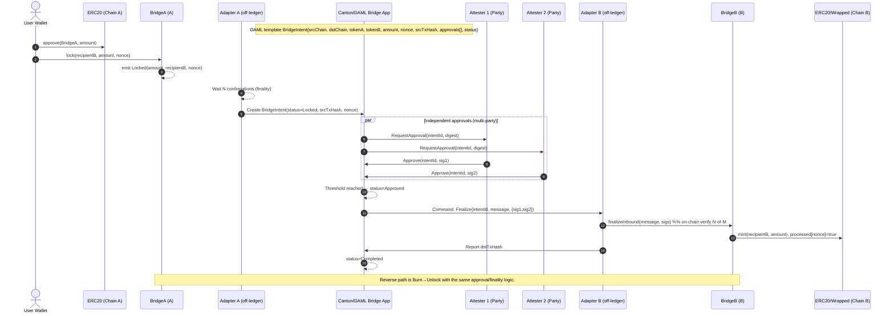

```mermaid
sequenceDiagram
  autonumber
  actor User as User Wallet
  participant TokenA as ERC20 (Chain A)
  participant BridgeA as BridgeA (A)
  participant AdapterA as Adapter A (off-ledger)
  participant Canton as Canton/DAML Bridge App
  participant Att1 as Attester 1 (Party)
  participant Att2 as Attester 2 (Party)
  participant AdapterB as Adapter B (off-ledger)
  participant BridgeB as BridgeB (B)
  participant TokenB as ERC20/Wrapped (Chain B)

  Note over Canton: DAML template BridgeIntent{srcChain, dstChain, tokenA, tokenB, amount, nonce, srcTxHash, approvals[], status}

  User->>TokenA: approve(BridgeA, amount)
  User->>BridgeA: lock(recipientB, amount, nonce)
  BridgeA-->>BridgeA: emit Locked{amount, recipientB, nonce}
  AdapterA-->>AdapterA: Wait N confirmations (finality)
  AdapterA->>Canton: Create BridgeIntent(status=Locked, srcTxHash, nonce)

  par Independent approvals (multi-party)
    Canton->>Att1: RequestApproval(intentId, digest)
    Canton->>Att2: RequestApproval(intentId, digest)
    Att1->>Canton: Approve(intentId, sig1)
    Att2->>Canton: Approve(intentId, sig2)
  end
  Canton-->>Canton: Threshold reached → status=Approved

  Canton->>AdapterB: Command: Finalize(intentId, message, {sig1,sig2})
  AdapterB->>BridgeB: finalizeInbound(message, sigs)  %% on-chain verify N-of-M
  BridgeB->>TokenB: mint(recipientB, amount), processed[nonce]=true
  AdapterB->>Canton: Report dstTxHash
  Canton-->>Canton: status=Completed
  Note over BridgeA,BridgeB: Reverse path is Burn→Unlock with the same approval/finality logic.

```